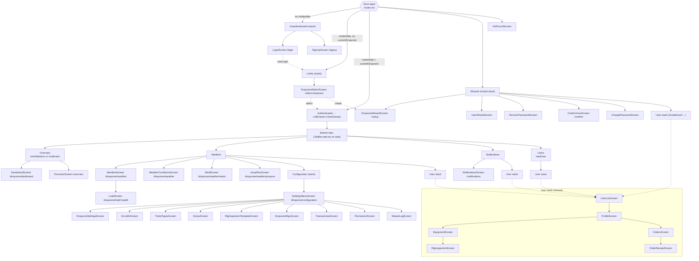
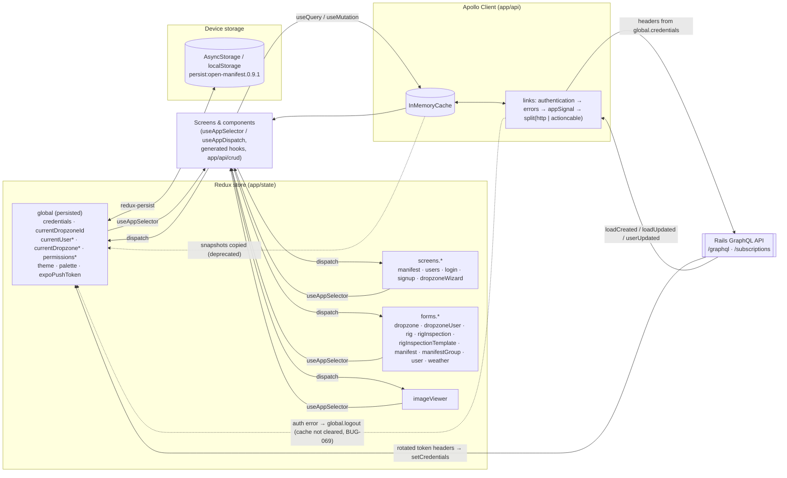

# OpenManifest client — diagrams

Client diagrams at `3112795` (pass 1, 2026-10-08). System, data-model, sequence and state diagrams are in the backend
repo: <https://github.com/OpenManifest/openmanifest-server/blob/staging/docs/reference/diagrams.md>.

## 1. Navigation map

Root stack branches are chosen from persisted Redux state (`app/screens/routes.tsx`). Paths are the deep-link paths from
the linking config; tabs marked with a permission are hidden without it.

Overlays mounted inside screens (not routes): manifest-user sheet (`app/forms/manifest_user`), manifest-group sheet
(`app/components/dialogs/ManifestGroup`, mounted only in `LoadScreen` — BUG-066), credits sheet (`app/forms/credits`),
image viewer, setup form sheets.

## 2. State and data flow (current: Redux + Apollo)

`*` deprecated snapshots of server data. Logout: `useLogout` aborts the shared `AbortController` (BUG-063), clears the
Apollo store and resets `global` only (forms/screens keep state, BUG-069).

Target after plan Phase 4: Apollo cache for all server data; zustand `useSession` (credentials in `expo-secure-store` on
native) and `usePreferences`; react-hook-form for forms; no Redux.
