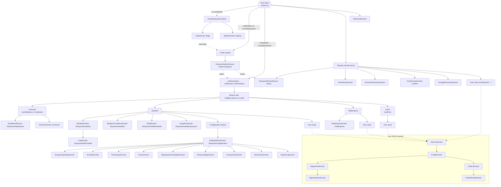
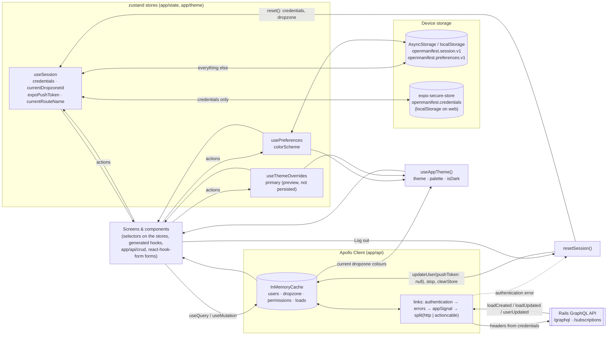

# OpenManifest client — diagrams

Client diagrams at `3112795` (pass 1, 2026-10-08). System, data-model, sequence and state diagrams are in the backend
repo: <https://github.com/OpenManifest/openmanifest-server/blob/staging/docs/reference/diagrams.md>.

## 1. Navigation map

Root stack branches are chosen from the session store (`app/screens/routes.tsx`: credentials, current dropzone id). Paths are the deep-link paths from
the linking config; tabs marked with a permission are hidden without it.

Overlays mounted inside screens (not routes): manifest-user sheet (`app/forms/manifest_user`), manifest-group sheet
(`app/forms/manifest_group`, mounted once by `ManifestContextProvider`), credits sheet (`app/forms/credits`),
image viewer, setup form sheets.

## 2. State and data flow (zustand + Apollo)

Server data is read from Apollo only (no copies of the current user, dropzone or permissions in client state). Forms are
react-hook-form instances owned by their screen or dialog (`app/forms/<name>`), so they go away with it; shared
dialogs live in the manifest context, `ProfileDialogsProvider` and `WeatherFormProvider`. Logging out and an expired
session both go through `resetSession`; switching dropzone resets the Apollo store.
